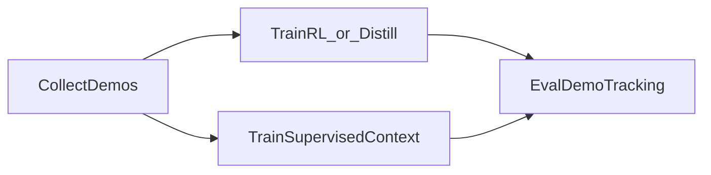

# Demo Mimic Agent Guide

This document is a central reference for Cursor agents working on the demo-tracking / demo-mimic pipeline in this repository.

## Style preferences

Prefer creating new abstractions and files over populating an existing file or class with unintended side effects.

It's fine to make certain assumptions about what the inputs to a function are. For these assumptions, just use an assert to check that the inputs are as expected, don't add bloat with if statements. We want to reduce bloat, so only assert where necessary/failing silently is possible.

## Scope and Primary Flow

The pipeline is:
1. collect demonstrations
2. train with either RL/distillation or supervised context
3. evaluate demo tracking quality



## Entrypoints and Purpose

### 1) Demo collection

- Script: `scripts/reinforcement_learning/rsl_rl/collect_demos.py`
- Typical task: `OmniFromDemo-UR5eRobotiq2f85-CollectDemos-v0`
- Purpose:
  - Load a trained checkpoint and roll out policy behavior in the from-demo environment.
  - Save episode datasets that include observations, actions, rewards, and reset-relevant state.
- Key inputs:
  - checkpoint (`--checkpoint` or `--use_pretrained_checkpoint`)
  - number of demos (`--num_demos`, `--max_demos_before_saving`)
  - optional raw-state capture (`--save_raw_states`, `--state_capture_interval`)
- Main outputs:
  - episodes in `logs/rsl_rl/<experiment>/<run>/episodes/<timestamp>/episodes_*.pt`
  - optional `action_discretization_spec.json` near saved episodes when discrete wrapper is enabled

### 2A) RL training (from scratch or resume)

- Script: `scripts/reinforcement_learning/rsl_rl/train.py`
- Typical task: `OmniFromDemo-UR5eRobotiq2f85-Train-v0`
- Purpose:
  - Train long-context PPO policy in IsaacLab from-demo env.
  - Optionally resume from checkpoints.
- Key inputs:
  - task id (`--task`)
  - env count (`--num_envs`)
  - max iterations (`--max_iterations`)
  - distributed settings (`--distributed`)
- Main outputs:
  - checkpoints and logs in `logs/rsl_rl/<experiment>/<timestamp>[_run_name]/`
  - env/agent yaml dumps in `params/`

### 2B) Distillation training

- Script: `scripts/reinforcement_learning/rsl_rl/train.py`
- Typical task: `OmniFromDemo-UR5eRobotiq2f85-Distillation-v0`
- Purpose:
  - Run student-teacher distillation using configured teacher expert checkpoint.
- Key config:
  - `source/uwlab_tasks/uwlab_tasks/manager_based/manipulation/from_demo/config/ur5e_robotiq_2f85/agents/distillation_rsl_rl_cfg.py`
- Main outputs:
  - distillation checkpoints/logs under the configured distillation experiment name

### 2C) Supervised context training

- Script: `scripts/reinforcement_learning/rsl_rl/train_supervised_context.py`
- Purpose:
  - Train `ContextSequencePolicy` from saved episode files using per-step supervision.
- Key config:
  - `source/uwlab_rl/uwlab_rl/rsl_rl/supervised_context_cfg.py`
  - optional task-level defaults in `.../agents/supervised_context_cfg.py`
- Key inputs:
  - `--episode_paths` (required unless supplied in config)
  - optional overrides like `--batch_size`, `--num_steps`, `--context_token_layout`
- Main outputs:
  - checkpoints in `logs/rsl_rl/supervised_context/<timestamp>*/model_*.pt`
  - dumped config in `params/trainer.yaml`

### 3) Demo tracking evaluation

- Script: `scripts/reinforcement_learning/rsl_rl/eval_demo_tracking.py`
- Typical task: `OmniFromDemo-UR5eRobotiq2f85-Eval-v0` (or supervised eval variant)
- Purpose:
  - Evaluate tracking quality by pairing rollout episodes with their context demos.
  - Supports RL checkpoint inference or supervised-context checkpoint inference.
- Key inputs:
  - RL checkpoint (`--checkpoint`) and task
  - optional supervised override (`--supervised_context_checkpoint`)
  - rollout count (`--num_rollouts`)
- Main outputs:
  - paired rollout files in
    `.../eval_demo_tracking/.../demo_tracking_rollouts/<timestamp>/rollout_pairs_*.pt`
  - optional videos and visualizations

## Task and Config Wiring (IsaacLab-first)

Task registration lives in:
- `source/uwlab_tasks/uwlab_tasks/manager_based/manipulation/from_demo/config/ur5e_robotiq_2f85/__init__.py`

Each task id maps to an env config entrypoint and an agent config entrypoint.

| Task ID | Env cfg entrypoint | Agent cfg entrypoint | Intended use |
|---|---|---|---|
| `OmniFromDemo-UR5eRobotiq2f85-CollectDemos-v0` | `rl_state_cfg:Ur5eRobotiq2f85RelJointPosDemoCollectCfg` | `agents.collect_demos_cfg:CollectDemosPolicyRunnerCfg` | demo data collection |
| `OmniFromDemo-UR5eRobotiq2f85-Train-v0` | `rl_state_cfg:Ur5eRobotiq2f85RelJointPosFromDemoTrainCfg` | `agents.rsl_rl_cfg:PPOWithContextRunnerCfg` | RL long-context training |
| `OmniFromDemo-UR5eRobotiq2f85-Distillation-v0` | `distillation_rl_state_cfg:Ur5eRobotiq2f85RelJointPosFromDemoDistillationCfg` | `agents.distillation_rsl_rl_cfg:DistillationLongContextRunnerCfg` | student-teacher distillation |
| `OmniFromDemo-UR5eRobotiq2f85-Eval-v0` | `rl_state_cfg:Ur5eRobotiq2f85RelJointPosFromDemoTrainCfg` | `agents.rsl_rl_cfg:PPOWithContextRunnerCfg` | RL evaluation |
| `OmniFromDemo-UR5eRobotiq2f85-SupervisedEval-v0` | `rl_state_cfg:Ur5eRobotiq2f85RelJointPosFromDemoSupervisedEvalCfg` | `agents.rsl_rl_cfg:PPOWithContextRunnerCfg` | supervised policy evaluation in from-demo env |

Where to edit behavior:
- Environment dynamics, observations, terminations, context defaults:
  - `source/uwlab_tasks/.../rl_state_cfg.py`
- RL training hyperparameters / policy architecture:
  - `source/uwlab_tasks/.../agents/rsl_rl_cfg.py`
- Distillation runner and student-teacher settings:
  - `source/uwlab_tasks/.../agents/distillation_rsl_rl_cfg.py`
- Supervised trainer defaults:
  - `source/uwlab_rl/uwlab_rl/rsl_rl/supervised_context_cfg.py`

## Context and Reset Quirks (Project-Specific)

These are critical to avoid incorrect assumptions:

- `FromDemoEnv` is custom (`source/uwlab_tasks/.../from_demo/env.py`), not plain IsaacLab reset behavior.
- `DemoTrackingContext` requires non-empty `episode_paths`; loaded episodes must contain `states` and `physics`.
- Debug observation channels are stripped from stored context obs during load to keep context tensors clean.
- `demo_obs_max_len` is explicitly overridden to `100` in `DemoTrackingContext`, regardless of inferred max.
- When `use_raw_states=True`:
  - raw reset states are loaded via `multi_reset_manager.load_raw_states(...)`
  - timesteps are staged in `pending_raw_timesteps`
  - `_reset_idx` restores `episode_length_buf` and `start_timesteps` after base reset
- When state dict contains `multi_reset_task_id` and `multi_reset_state_index`, saved-state multi-reset path is used.
- `state_noise_scale` applies gaussian noise to loaded reset states.
- Action discretization spec (`action_discretization_spec.json`) is auto-discovered from episode directory and propagated to policy when present.

## Common Pitfalls and Fast Checks

- Empty / wrong `episode_paths` -> context construction failure.
- Mixed episode shapes across files -> load/pad failures in dataset/context utilities.
- Distributed training startup collision -> set a different torch distributed master port.
- `include_current_trajectory=True` in supervised training is currently unsupported and raises an error.
- `share_current_and_context_obs_projection=True` requires `current_obs` and `context_obs` feature sizes to match; otherwise model init/token build raises an error.
- `encoding_projection_hidden_dim=<N>` switches obs encoders from a single linear projection to a shallow MLP (`in -> N -> embedding`).
- For supervised eval, ensure `--supervised_context_checkpoint` and compatible observation keys are provided.

## Canonical Commands

These are the baseline commands used in this project.

### Collect demos

```bash
python scripts/reinforcement_learning/rsl_rl/collect_demos.py \
  --task OmniFromDemo-UR5eRobotiq2f85-CollectDemos-v0 \
  --num_envs 2 \
  --checkpoint peg_state_rl_expert.pt \
  --num_demos 4 \
  --max_demos_before_saving 4 \
  --headless \
  env.scene.insertive_object=peg \
  env.scene.receptive_object=peghole
```

### RL training

```bash
python scripts/reinforcement_learning/rsl_rl/train.py \
  --task OmniFromDemo-UR5eRobotiq2f85-Train-v0 \
  --num_envs 128 \
  --logger wandb \
  --headless \
  env.scene.insertive_object=peg \
  env.scene.receptive_object=peghole
```

### Distillation training

```bash
python scripts/reinforcement_learning/rsl_rl/train.py \
  --task OmniFromDemo-UR5eRobotiq2f85-Distillation-v0 \
  --num_envs 128 \
  --logger wandb \
  --headless \
  env.scene.insertive_object=peg \
  env.scene.receptive_object=peghole
```

### Supervised context training

```bash
python scripts/reinforcement_learning/rsl_rl/train_supervised_context.py \
  data.episode_paths='["episodes/20260208_011257/episodes_*.pt"]'
```

### Evaluate demo tracking

```bash
python scripts/reinforcement_learning/rsl_rl/eval_demo_tracking.py \
  --task OmniFromDemo-UR5eRobotiq2f85-Eval-v0 \
  --num_rollouts 50 \
  --num_envs 32 \
  --checkpoint cube_tracking_transformer_actor.pt \
  --headless \
  env.scene.insertive_object=rectangle \
  env.scene.receptive_object=wall
```

## Notes for Cursor Agents

- Prefer modifying IsaacLab config classes over hard-coding script behavior.
- When changing context behavior, verify both:
  - runtime reset path (`FromDemoEnv._reset_idx`)
  - training/eval data expectations (`ContextStepDataset`, eval rollout pairing)
- Keep task id, env config, and agent config consistent; most failures come from cross-file mismatch between these three.
